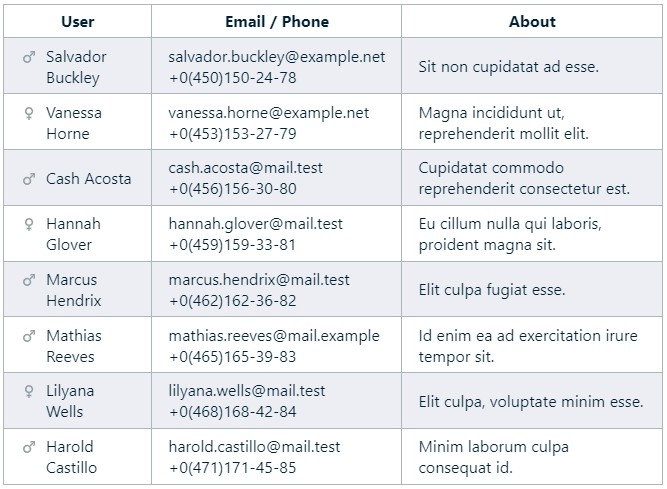

# 🎲 Lorem Ipsum fake generator

Легкий минималистичный генератор фейковых данных.

## Установка

    npm i -D lorem-faker

## 🔥 Пример использования

```ts
import { 
  type TGender, 
  PhoneGenerator, 
  LoremGenerator, 
  PersonGenerator 
} from 'lorem-faker'

const lorem = new LoremGenerator({ sentence: { min: 30, max: 60 } })
const phone = new PhoneGenerator('+{0-0} {450-460} {600-700} 78 {10-80}')
const person = new PersonGenerator({
  ageRange: { min: 30, max: 40 },
  genderRatio: 0.4,
  // strategy: { ... }
})

// Определяем любой подходящий тип полей, имена не имеют значения
type UserData = {
  id: number
  name: string
  login: string
  email: string
  phone: string
  age: number
  gender: TGender
  about: string
}

// Генератор возвращает доступ к текущему контексту
// с методами получения уникальных записей.
for (const ctx of person.generate(10)) {
  const user: UserData = {
    // Порядок получения полей не имеет значения
    id: ctx.id(),
    // При запросе login/email/fullName всегда генерируются name+surname
    login: ctx.login(),
    // уже было сгенерировано, так как от name может зависеть login
    name: ctx.name(),
    email: ctx.email(),
    gender: ctx.gender(),
    age: ctx.age(),
    // Функции next() возвращают следующее уникальное значение
    phone: phone.next(),
    // Набор слов Lorem ipsum
    about: lorem.sentence()
  }
}

// Так же доступны независимые функции.
const text = sentence(50, 180) // min, max
// Точное количество символов предложения включая точку.
const strict = generateSentence(78)
```

**Результат**

```
┌─────────┬──────────────────────────────────┐
│ id      │ 5                                │
│ login   │ 'farrell.graham'                 │
│ name    │ 'Graham'                         │
│ email   │ 'okra.graham@mail.test'          │
│ phone   │ '+0 460 675 19 63'               │
│ age     │ 31                               │
│ gender  │ 'male'                           │
│ about   │ 'Exercitation, exercitation nisi │
│         │  adipiscing laboris veniam.'     │
└─────────┴──────────────────────────────────┘
```

**Пример**



## API

**class PersonGenerator**

* `name()` - Случайное имя (1500+).
* `surname()` - Случайная фамилия (900+).
* `fullName()` - Полное имя.
* `login()` - Уникальный логин.
* `email()` - Электронная почта.
* `gender()` - `'male' | 'female'`.
* `age()` - Возраст.

**class PhoneGenerator**

* `phone()` - Телефон.

Телефоный номер генерируется по заданному пользователькому шаблону:

    '+{7-8}({450-499})999-99-99'

* `0-9` - Любая цифра определяет место и верхнюю границу. Пример: `84` генерирует диапазон от `0` до `84`.
* `{X-X}`  - Фигурными скобками обозначается диапазон. Скобки будут удалены. Пример: `{7-10}` сгенерирует `7, 8, 9, 10`
* `*` - Все остальные символы остаются в шаблоне как есть.

**class LoremGenerator**

Генерируемые слова гарантированно находятся в списке [Lorem ipsum](./src/lorem.ts)

* `word()` - Случайное слово из набора _Lorem ipsum ..._.
* `generateSentence(length)` - Предложение с точным количеством символов.
* `sentence(min, max)` - Предложение ограниченное диапазоном.
* `generateParagraph(length)` - Параграф с точным количеством символов.
* `paragraph(min, max)` - Параграф.
* `post(num, min, max)` - Несколько параграфов.

**Другие функции и классы**

* `animal()` + Список животных(200+).
* `plant()` + Список растений(2700+).
* **NumGenerator** - Генерация уникальных числовых последовательностей.
* **NumTupleGenerator** - Генерация уникальных кортежей.
* **NumPermutationGenerator** - Генерация кортежей с перестановкой индексов.
* **NumCombinationGenerator** - Генерация со всеми комбинациями.
* **ShuffledKeyGenerator** - Генерация пользовательских значений с точным количеством выпадений.
* `...` - другие функции и классы + типизация `TS`.

```ts
import { NumTupleGenerator, ShuffledKeyGenerator } from 'lorem-faker'

// Задаем верхнюю границу диапазона от 0 до n-1
const tuples = new NumTupleGenerator<[number, number, number]>([7, 500, 100])

tuples.next() // [7, 457, 68]

const keys = new ShuffledKeyGenerator([['foo', 10], ['bar', 20]])
// 'foo' - выпадет 10 раз, 'bar' - выпадет 20 раз
keys.next() 
```

## Ссылки

* [lipsum.com](https://lipsum.com/). Оригинальный `Lorem ipsum ...` имеет 69(63 уникальных) слов от `2` до `13` символов.
* Здесь можно найти [файлы с именами](https://www.ssa.gov/oact/babynames/limits.html) `male/female`.
* [Фамилии](https://www.census.gov/topics/population/genealogy/data/2010_surnames.html) по данным переписи 2010 года.
* Список [животных](https://en.wikipedia.org/wiki/List_of_animal_names).
* Список [растений](https://plants.sc.egov.usda.gov/downloads).
